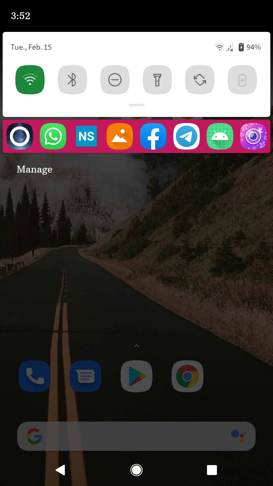
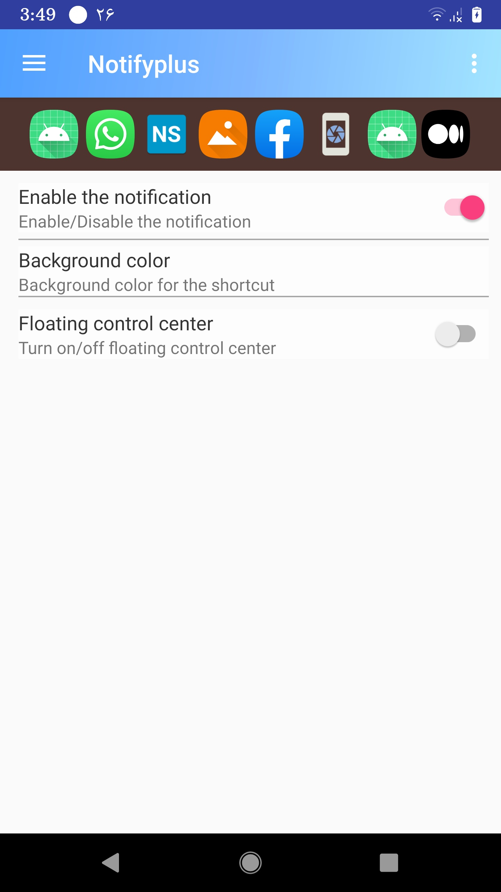
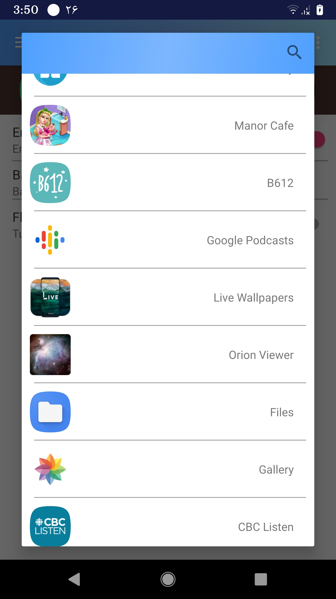
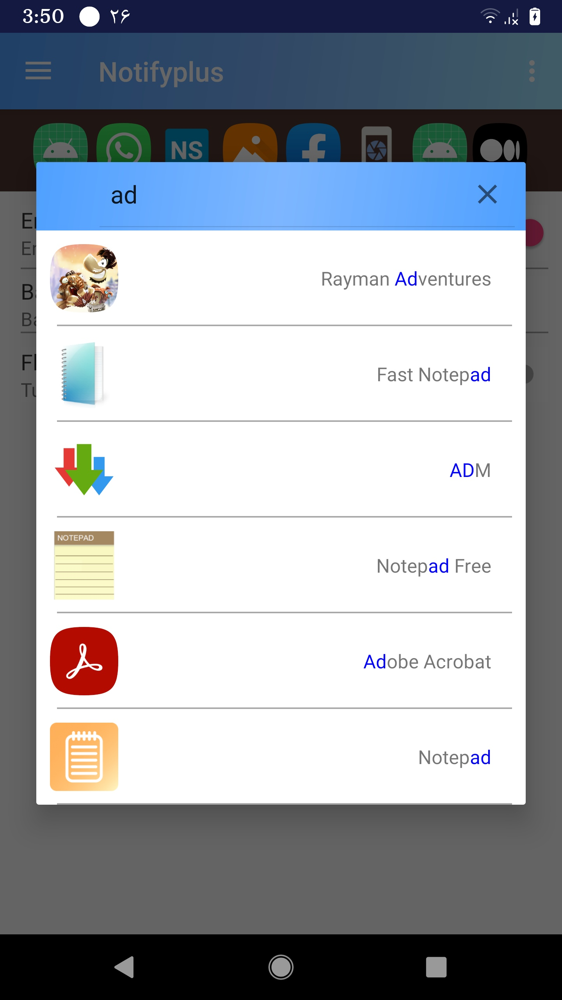

<h1 align="center">NotifyPlus</h1>

NotifyPlus is an open source application with which you can have shortcuts of your favorite apps in the notification bar.

back in 2017 I published a Persian version of this app in the most famous local android market of Iran: "https://cafebazaar.ir/app". 
During 2018, NotifyPlus was highlighted in that market as "the editor's choice in Tools category" and hit 5000+ active daily users by the end of 2018. 

After my immigration to Canada, I have removed this app from all markets and am publishing its source code in this repository.

The app is fully stable and runnable on an Android phone running Android Lollipop (API 21) above.

NotifyPlus is currently under active development and all contributions are welcome!

-------------------------------------------------
NOTIFY PLUS – FEATURES
-------------------------------------------------

• A pleaseing stationary notification that shows shortcuts to your favorite apps 

• The ability to change the background color of the notification

• A searchable list of all the installed apps in your device. You can choose your favorite shortcuts among those apps

-------------------------------------------------
screenshots of the app:

-------------------------------------------------

Newer versions of Android have imposed so many <a href="https://developer.android.com/guide/components/activities/background-starts">restrictions on starting activities from background</a>. As a result, it's unjustifiably hard and tedious to improve Notify Plus's performance. And also some issue of this repo (such as issue #5) are hard to resolve. I have decided to stop working full time on this repo and spend my time on other mobile projects I have here. 
